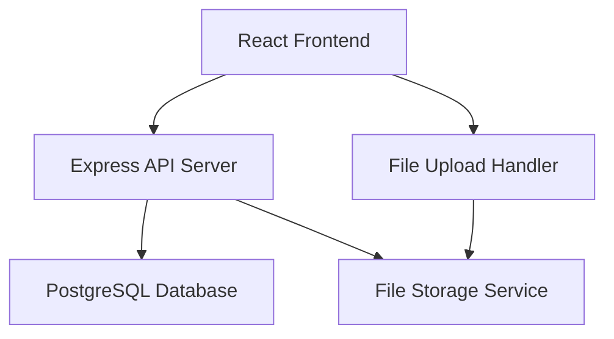

# Event Tracking System Design

## Overview

The Event Tracking System is a web-based application that provides manual event logging with timeline visualization and advanced search capabilities. The system follows a modern client-server architecture with a React frontend and Node.js/Express backend, using a relational database for data persistence.

## Architecture

### High-Level Architecture



### Technology Stack

- **Frontend**: React with TypeScript, React Router, Tailwind CSS
- **Backend**: Node.js with Express, TypeScript
- **Database**: PostgreSQL with Prisma ORM
- **File Storage**: Local filesystem (with option to extend to cloud storage)
- **Authentication**: JWT-based authentication
- **Search**: Full-text search using PostgreSQL's built-in capabilities

## Components and Interfaces

### Frontend Components

#### Core Components
- `EventTimeline`: Main timeline view with infinite scroll
- `EventCard`: Individual event display in timeline
- `EventDetail`: Detailed event view modal/page
- `EventForm`: Create/edit event form with type-specific fields
- `SearchBar`: Advanced search interface with filters
- `TagManager`: Tag creation and management
- `UserSelector`: Multi-select user assignment component

#### Layout Components
- `AppLayout`: Main application layout with navigation
- `Sidebar`: Navigation and quick filters
- `Header`: Search bar and user menu

### Backend API Endpoints

#### Event Management
- `POST /api/events` - Create new event
- `GET /api/events` - Get events with pagination and filters
- `GET /api/events/:id` - Get specific event details
- `PUT /api/events/:id` - Update event
- `DELETE /api/events/:id` - Delete event

#### Search and Filtering
- `GET /api/events/search` - Advanced search with multiple criteria
- `GET /api/tags` - Get all available tags
- `GET /api/users` - Get all users for assignment

#### File Management
- `POST /api/files/upload` - Upload files for events
- `GET /api/files/:id` - Download/serve files

## Data Models

### Event Model
```typescript
interface Event {
  id: string;
  title: string;
  content: string;
  type: EventType;
  timestamp: Date;
  createdAt: Date;
  updatedAt: Date;
  creatorId: string;
  creator: User;
  assignedUsers: User[];
  tags: Tag[];
  attachments: Attachment[];
  metadata: Record<string, any>; // Type-specific data
}

enum EventType {
  SIMPLE_MESSAGE = 'simple_message',
  PHOTO_WITH_NOTES = 'photo_with_notes',
  EMAIL = 'email',
  TEXT = 'text',
  DOCUMENT = 'document'
}
```

### User Model
```typescript
interface User {
  id: string;
  username: string;
  email: string;
  displayName: string;
  createdAt: Date;
  createdEvents: Event[];
  assignedEvents: Event[];
}
```

### Tag Model
```typescript
interface Tag {
  id: string;
  name: string;
  color?: string;
  createdAt: Date;
  events: Event[];
}
```

### Attachment Model
```typescript
interface Attachment {
  id: string;
  filename: string;
  originalName: string;
  mimeType: string;
  size: number;
  path: string;
  eventId: string;
  uploadedAt: Date;
}
```

### Database Schema

#### Events Table
- Primary key: `id` (UUID)
- Foreign key: `creator_id` references Users
- Indexes: `timestamp`, `type`, `creator_id`
- Full-text search index on `title` and `content`

#### Event_User_Assignments Table (Many-to-Many)
- `event_id` references Events
- `user_id` references Users
- Composite primary key

#### Event_Tags Table (Many-to-Many)
- `event_id` references Events
- `tag_id` references Tags
- Composite primary key

## Error Handling

### Frontend Error Handling
- Global error boundary for React component errors
- API error interceptors with user-friendly messages
- Form validation with real-time feedback
- Network error handling with retry mechanisms

### Backend Error Handling
- Centralized error middleware
- Input validation using Joi or Zod
- Database constraint error handling
- File upload error handling (size limits, type validation)

### Error Response Format
```typescript
interface ErrorResponse {
  error: {
    code: string;
    message: string;
    details?: any;
  };
  timestamp: string;
  path: string;
}
```

## Testing Strategy

### Frontend Testing
- **Unit Tests**: Component testing with React Testing Library
- **Integration Tests**: API integration tests with MSW (Mock Service Worker)
- **E2E Tests**: Critical user flows with Playwright or Cypress

### Backend Testing
- **Unit Tests**: Service and utility function tests with Jest
- **Integration Tests**: API endpoint tests with supertest
- **Database Tests**: Repository layer tests with test database

### Test Coverage Goals
- Minimum 80% code coverage for backend services
- 70% coverage for frontend components
- 100% coverage for critical business logic

### Key Test Scenarios
1. Event creation with different types
2. Timeline pagination and filtering
3. Search functionality with various criteria
4. File upload and attachment handling
5. User assignment and permission validation
6. Tag management and association

## Performance Considerations

### Frontend Optimization
- Virtual scrolling for large timeline datasets
- Image lazy loading for photo events
- Component memoization for expensive renders
- Bundle splitting for code optimization

### Backend Optimization
- Database query optimization with proper indexes
- Pagination for large result sets
- File upload streaming for large files
- Caching for frequently accessed data

### Search Optimization
- Database indexes on searchable fields
- Search result pagination
- Debounced search input to reduce API calls
- Search result caching for common queries

## Security Considerations

### Authentication & Authorization
- JWT token-based authentication
- Role-based access control (future enhancement)
- Event ownership validation for edit/delete operations

### Data Protection
- Input sanitization and validation
- SQL injection prevention through ORM
- File upload security (type validation, size limits)
- XSS prevention in user-generated content

### API Security
- Rate limiting on API endpoints
- CORS configuration
- Request size limits
- Secure file serving with proper headers